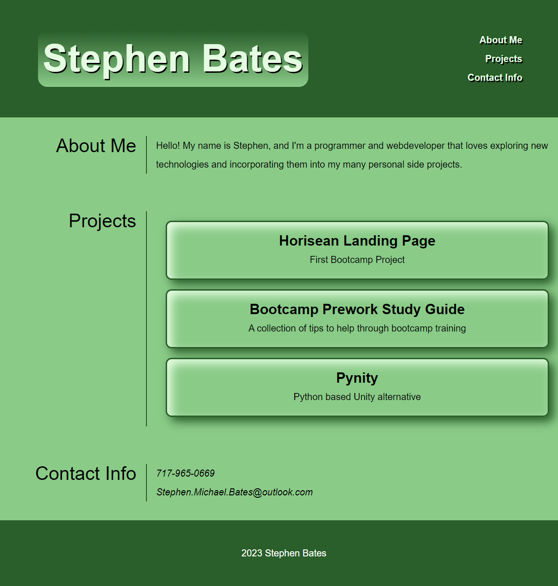

# Portfolio

## Portfolio page for hosting references to my published projects

This web page acts as a way for me to tell people a little about myself, as well as a collection of projects I have worked on and a place for people to find how to contact me

As I continue to work on more projects, more will be added or switched out as need be. It will also serve as a place for me to experiment with new design techniques and will hopefully reflect my journey going forward.

## Installation

N/A

## Usage

The web page can currently be found hosted on Github [here](https://stephen-bates.github.io/Portfolio/).

The should resemble the image below:

## Credits

All HTML and CSS is entirely original, designed by myself

## Liscense

N/A